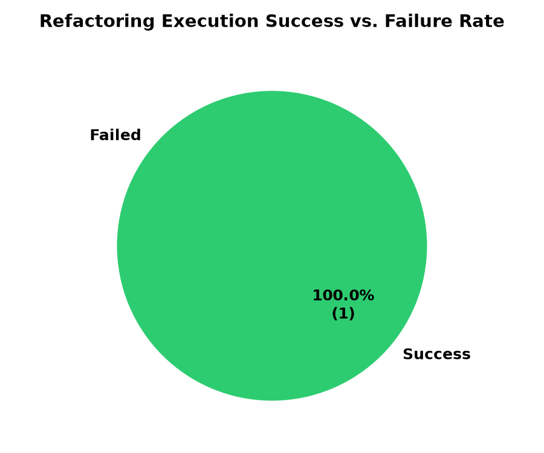
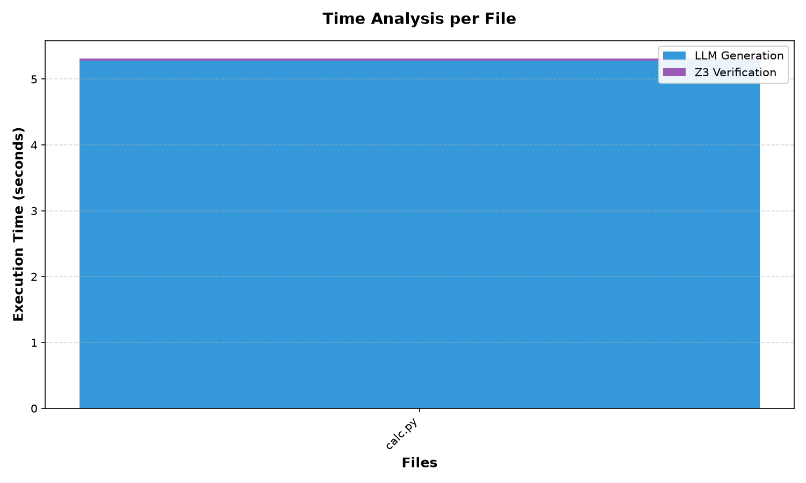

# Thesis Execution Report: Neuro-Symbolic Code Modernization

**Date:** 2026-07-11 12:28:39
**System Version:** NeSyMA MK-2 (Neuro-Symbolic Modernization Agent)

## 1. Executive Summary
This report presents the execution results of the Neuro-Symbolic Code Modernization pipeline. The framework leverages LLMs (Gemini Provider) for code refactoring and the Z3 Theorem Prover (SMT solver) for formal verification of semantic equivalence.

## 2. Key Performance Metrics

| Metric | Value |
| :--- | :--- |
| **Total Files Processed** | 1 |
| **Successful Refactorings** | 1 |
| **Failed Refactorings** | 0 |
| **Overall Success Rate** | **100.00%** |
| **Average LLM Generation Time** | 5.28 seconds |
| **Average Z3 Verification Time** | 0.03 seconds |
| **Average Total Time per File** | **5.32 seconds** |

## 3. Visualizations

### Success vs. Failure Rate

### Execution Time Breakdown

## 4. Failed Files Log
*No failures occurred during this execution run. All files were successfully modernized and formally verified.*

## 5. Architectural Overview
The NeSyMA MK-2 framework operates in two distinct phases:
1. **Neural Phase (Generative AI):** The legacy Python code is analyzed, and the `GeminiProvider` refactors it into modernized Python syntax (incorporating type annotations, list comprehensions, etc.).
2. **Symbolic Phase (Verification):** Both legacy and modernized codes are parsed into ASTs using a Tree-Sitter based `LegacyCodeParser`. A `Z3Translator` extracts mathematical assertions from these ASTs, and the `EquivalenceVerifier` queries Z3 SMT solver to formally prove or disprove equivalence.

---
*Generated automatically by NeSyMA-MK_2 Report Generator.*
